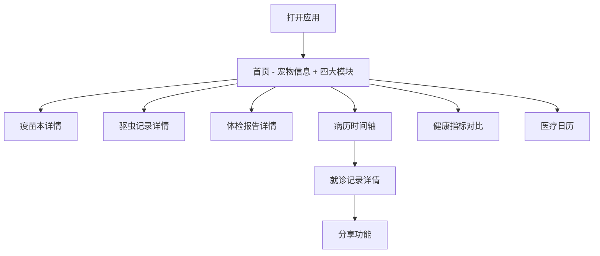

## 1. 产品概述

宠物健康档案H5应用是一款面向宠物主人的移动端电子健康记录管理工具，帮助用户系统化地管理宠物的疫苗接种、驱虫记录、体检报告和就诊病历，提供健康指标对比分析和医疗日历提醒功能。

- **目标用户**：养宠人士（猫、狗等宠物主人）
- **核心价值**：一站式宠物健康管理，医疗记录随时查阅，健康趋势一目了然
- **使用场景**：居家查看宠物健康档案、就医时携带电子病历、定期健康提醒

## 2. 核心功能

### 2.1 功能模块总览

1. **首页**：宠物信息卡片、疫苗本、驱虫记录、体检报告、病历时间轴
2. **就诊记录详情页**：单次就诊完整信息展示
3. **健康指标对比页**：体重、血常规、生化指标对比可视化
4. **医疗日历页**：疫苗/驱虫/复诊等医疗事件日历视图

### 2.2 页面详情

| 页面名称 | 模块名称 | 功能描述 |
|----------|----------|----------|
| 首页 | 宠物信息卡片 | 展示宠物头像、名称、品种、年龄、性别等基本信息 |
| 首页 | 疫苗本模块 | 已接种疫苗列表及到期日期，过期疫苗标红突出显示 |
| 首页 | 驱虫记录模块 | 时间线形式展示体内外驱虫历史，标注下次驱虫提醒 |
| 首页 | 体检报告模块 | 最近体检日期及异常项目摘要，支持展开查看详情 |
| 首页 | 病历时间轴模块 | 按日期倒序展示就诊记录，关键信息预览 |
| 就诊详情页 | 就诊信息展示 | 就诊日期、医院、主治医生、主诉、检查项目、诊断结论、药物处方、治疗建议 |
| 就诊详情页 | 操作按钮 | 返回首页、分享功能 |
| 健康对比页 | 体重趋势对比 | 最近两次体检体重变化，折线图可视化 |
| 健康对比页 | 血常规对比 | 关键血常规指标柱状图对比，标注好转/恶化 |
| 健康对比页 | 生化检查对比 | 关键生化指标柱状图对比，数值标注 |
| 医疗日历页 | 日历视图 | 月视图展示医疗事件，支持切换月份 |
| 医疗日历页 | 事件类型 | 疫苗接种、驱虫、复诊等不同颜色标识 |
| 医疗日历页 | 事件提醒 | 近期即将到来的医疗事件列表 |

## 3. 核心流程

### 3.1 主要用户流程

用户打开应用后，首先进入首页查看宠物基本信息和四大健康模块概览。用户可以点击各模块进入详情页面，或通过底部导航切换到健康对比和医疗日历页面。查看就诊记录时可以看到完整的诊疗信息，并支持分享功能。

## 4. 用户界面设计

### 4.1 设计风格

- **整体风格**：简洁友好、专业可信、温馨柔和
- **主色调**：柔和的薄荷绿（#4ECDC4），代表健康与活力
- **辅助色**：温暖的珊瑚橙（#FF6B6B）用于提醒和强调，淡紫色（#A8E6CF）用于装饰
- **中性色**：米白色背景（#FAFAFA），深灰色文字（#333333），浅灰色分隔（#E0E0E0）
- **按钮风格**：圆角按钮，柔和阴影，悬停微动画
- **字体**：系统无衬线字体，标题加粗，正文清晰易读
- **布局风格**：卡片式布局，圆角设计，柔和阴影
- **图标风格**：线性图标，简洁明了，统一 stroke 宽度
- **动效**：页面切换淡入淡出，卡片悬停轻微上浮，按钮点击反馈

### 4.2 页面设计概述

| 页面名称 | 模块名称 | UI元素 |
|----------|----------|--------|
| 首页 | 宠物信息卡片 | 圆角头像、名称标签、品种/年龄/性别图标标签、柔和渐变背景 |
| 首页 | 功能入口区 | 2x2网格布局、图标+文字、卡片悬停上浮效果 |
| 首页 | 疫苗/驱虫/体检/病历模块 | 卡片容器、标题栏、列表项、过期红色警示标记 |
| 就诊详情页 | 信息分区 | 分组标题、信息列表、标签式分类、重要信息高亮 |
| 就诊详情页 | 底部操作栏 | 固定底部、返回按钮、分享按钮 |
| 健康对比页 | 图表区域 | 折线图/柱状图、图例、数据标签、趋势指示箭头 |
| 医疗日历页 | 日历网格 | 月份切换、日期格子、事件圆点标记、今日高亮 |
| 医疗日历页 | 事件列表 | 按日期分组、事件类型颜色标识、提醒标记 |

### 4.3 响应式设计

- **设计策略**：移动优先设计，适配主流移动设备屏幕
- **断点设置**：
  - 小屏手机（< 375px）：紧凑布局，字体适当缩小
  - 标准手机（375px - 428px）：默认布局
  - 大屏手机/平板（> 428px）：最大宽度限制，居中显示
- **触控优化**：按钮最小高度44px，触控区域充足，手势操作支持
- **安全区域**：适配刘海屏和底部安全区域

### 4.4 视觉强调

- **过期疫苗**：红色背景标签 + 红色文字 + 警告图标
- **异常指标**：橙色高亮 + 向上/向下箭头标识异常方向
- **即将到期**：黄色提醒标签 + 倒计时提示
- **重要信息**：加粗字体 + 背景色突出
