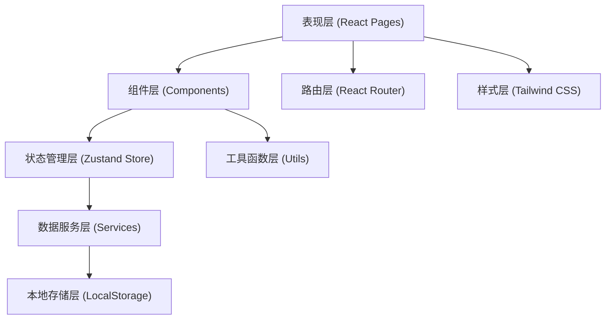
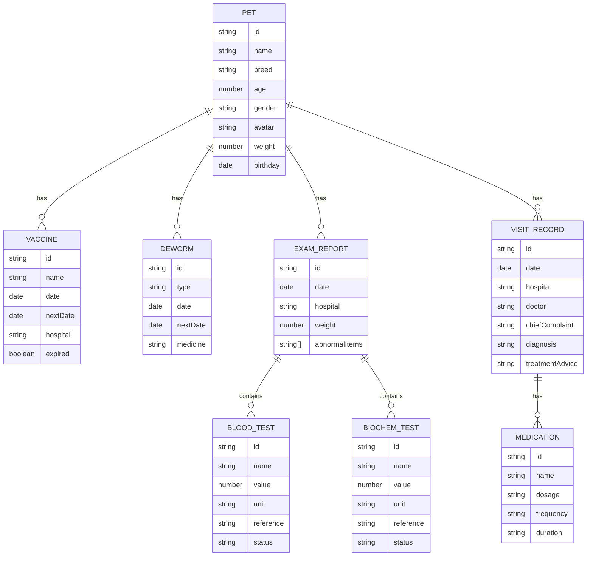

## 1. 架构设计



## 2. 技术描述

- **前端框架**：React 18 + TypeScript
- **构建工具**：Vite 5
- **样式方案**：Tailwind CSS 3
- **状态管理**：Zustand
- **路由管理**：React Router DOM 6
- **图表库**：Recharts
- **图标库**：Lucide React
- **数据持久化**：LocalStorage（封装工具类）
- **包管理器**：npm

## 3. 项目结构

```
src/
├── components/          # 通用组件
│   ├── PetCard.tsx          # 宠物信息卡片
│   ├── VaccineList.tsx      # 疫苗列表
│   ├── DewormTimeline.tsx   # 驱虫时间线
│   ├── ExamReport.tsx       # 体检报告
│   ├── MedicalTimeline.tsx  # 病历时间轴
│   ├── BottomNav.tsx        # 底部导航
│   └── SectionCard.tsx      # 分区卡片容器
├── pages/               # 页面组件
│   ├── Home.tsx            # 首页
│   ├── VisitDetail.tsx     # 就诊记录详情页
│   ├── HealthCompare.tsx   # 健康指标对比页
│   └── MedicalCalendar.tsx # 医疗日历页
├── store/               # 状态管理
│   └── usePetStore.ts      # 宠物健康数据store
├── data/                # Mock数据
│   └── mockData.ts         # 模拟数据
├── utils/               # 工具函数
│   ├── dateUtils.ts        # 日期工具
│   └── storage.ts          # 本地存储封装
├── types/               # TypeScript类型定义
│   └── index.ts            # 类型定义文件
├── App.tsx              # 应用入口组件
├── main.tsx             # 应用入口
└── index.css            # 全局样式
```

## 4. 路由定义

| 路由路径 | 页面名称 | 说明 |
|----------|----------|------|
| / | 首页 | 宠物信息 + 四大健康模块概览 |
| /visit/:id | 就诊记录详情页 | 单次就诊完整信息 |
| /compare | 健康指标对比页 | 体重、血常规、生化指标对比 |
| /calendar | 医疗日历页 | 医疗事件日历视图 |

## 5. 数据模型

### 5.1 数据模型定义



### 5.2 TypeScript 类型定义

```typescript
// 宠物基本信息
interface Pet {
  id: string;
  name: string;
  breed: string;
  age: number;
  gender: 'male' | 'female';
  avatar: string;
  weight: number;
  birthday: string;
}

// 疫苗记录
interface Vaccine {
  id: string;
  name: string;
  date: string;
  nextDate: string;
  hospital: string;
}

// 驱虫记录
interface Deworm {
  id: string;
  type: 'internal' | 'external';
  date: string;
  nextDate: string;
  medicine: string;
}

// 体检报告
interface ExamReport {
  id: string;
  date: string;
  hospital: string;
  weight: number;
  abnormalItems: string[];
  bloodTests: BloodTest[];
  biochemTests: BiochemTest[];
}

// 血常规指标
interface BloodTest {
  id: string;
  name: string;
  value: number;
  unit: string;
  reference: string;
  status: 'normal' | 'high' | 'low';
}

// 生化指标
interface BiochemTest {
  id: string;
  name: string;
  value: number;
  unit: string;
  reference: string;
  status: 'normal' | 'high' | 'low';
}

// 就诊记录
interface VisitRecord {
  id: string;
  date: string;
  hospital: string;
  doctor: string;
  chiefComplaint: string;
  examItems: string[];
  diagnosis: string;
  medications: Medication[];
  treatmentAdvice: string;
}

// 药物处方
interface Medication {
  id: string;
  name: string;
  dosage: string;
  frequency: string;
  duration: string;
}

// 日历事件
interface CalendarEvent {
  id: string;
  date: string;
  type: 'vaccine' | 'deworm' | 'recheck';
  title: string;
  description: string;
}
```

## 6. 状态管理设计

使用 Zustand 管理全局状态，包含：
- 宠物基本信息
- 疫苗记录列表
- 驱虫记录列表
- 体检报告列表
- 就诊记录列表

状态持久化：通过自定义 middleware 将状态同步到 LocalStorage，实现离线可用。

## 7. 性能优化策略

1. **组件懒加载**：页面级组件使用 React.lazy 按需加载
2. **Memo 优化**：列表项使用 React.memo 减少不必要重渲染
3. **图片优化**：使用合适尺寸图片，支持懒加载
4. **数据缓存**：本地存储优先，减少重复计算
5. **虚拟列表**：长列表数据采用虚拟滚动
